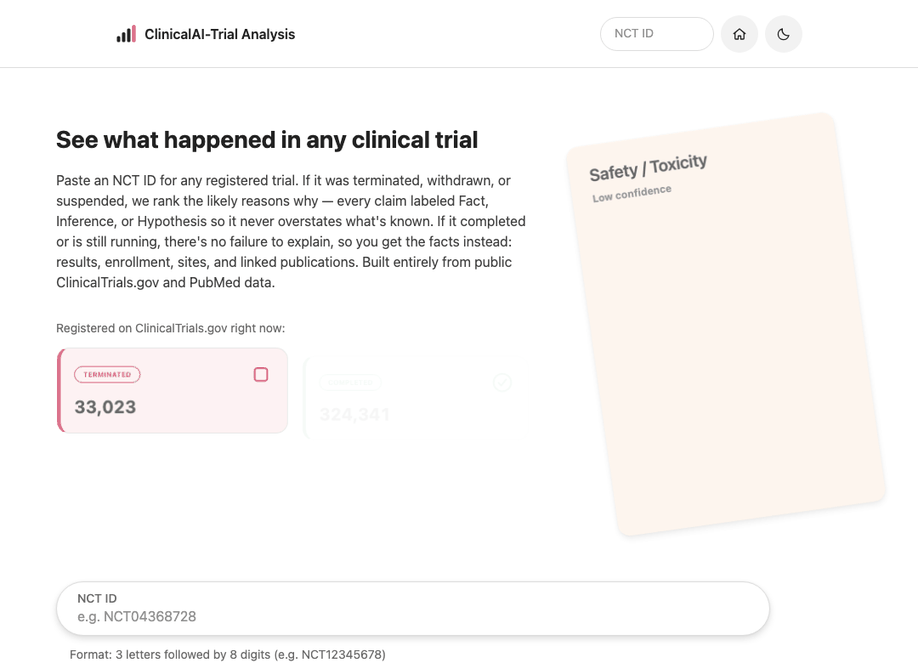

# ClinicalAI-Trial Analysis



Paste an NCT ID for any registered clinical trial. If it was terminated, withdrawn, or suspended, the app ranks the likely reasons why — every claim labeled **Fact**, **Inference**, or **Hypothesis** so it never overstates what's known. If the trial completed or is still running, there's no failure to explain, so it returns a plain factual snapshot instead: results, enrollment, sites, and linked publications. Built entirely from public [ClinicalTrials.gov](https://clinicaltrials.gov/) and [PubMed](https://pubmed.ncbi.nlm.nih.gov/) data — no accounts, no saved history.

## Features

- **NCT ID lookup** with a friction-less, auto-submitting input (no submit button — a valid ID navigates itself)
- **Failure reasoning** for TERMINATED / WITHDRAWN / SUSPENDED trials: ranked hypotheses (recruitment shortfall, efficacy miss, safety/toxicity, funding, operational issues, strategic deprioritization, futility) each with a confidence level and its strongest counter-argument
- **Fact-only snapshot** for every other status — phase, sponsor, timeline, enrollment, eligibility, sites, posted results, and linked publications, with zero LLM involvement
- **Live status counts** on the homepage, pulled directly from the ClinicalTrials.gov API
- **Light/dark theme**, keyboard-accessible throughout
- **No accounts, no tracking, no saved history** — every analysis is a stateless lookup

## How it works

1. The app fetches the trial's full record from **ClinicalTrials.gov v2** and resolves any linked publications via **PubMed E-utilities**.
2. If the trial's status is TERMINATED, WITHDRAWN, or SUSPENDED, the evidence is packaged and sent to **Claude** for a structured reasoning pass — output is validated against a strict schema so every claim carries an epistemic label.
3. Otherwise, the app skips the LLM entirely and renders a factual snapshot straight from the source record.

See [`docs/engineering/engineering-doc.md`](docs/engineering/engineering-doc.md) for the full pipeline and [`design.md`](design.md) for the visual system.

## Architecture & system design

### Why this exists

52,362 trials on ClinicalTrials.gov (8.8% of all registered studies) are TERMINATED, WITHDRAWN, or SUSPENDED, and most give only a terse one-line stop reason with no deeper context. Reconstructing *why* a trial actually failed today means manually cross-referencing ClinicalTrials.gov and PubMed by hand. This app automates that cross-reference into a single lookup — without ever presenting a guess as more certain than it is. That constraint (never overstate certainty) is the thing the whole system is built around: a hard schema gate rejects any LLM output that contains an unlabeled claim, and the reasoning pass itself is skipped entirely for any trial that isn't actually a failure.

### System diagram

```
                          ┌─────────────────────────┐
                          │        Browser           │
                          │  (React / Next.js UI)    │
                          └────────────┬─────────────┘
                                       │ GET /api/analyze/[nctId]
                                       ▼
                     ┌───────────────────────────────────┐
                     │     Next.js App Router server      │
                     │  app/api/analyze/[nctId]/route.ts  │
                     │           │                         │
                     │           ▼                         │
                     │  lib/pipeline/analyzeTrial.ts       │
                     │  (single orchestrator, called by     │
                     │   both the API route and the page)   │
                     └───┬───────────┬───────────┬─────────┘
                         │           │           │
             cache read/write   study + refs   reasoning pass
                         │           │       (failure statuses only)
                         ▼           ▼           ▼
              ┌──────────────┐ ┌───────────────┐ ┌─────────────────┐
              │   Supabase    │ │ ClinicalTrials │ │ PubMed E-utils   │
              │  (Postgres)   │ │  .gov v2 API   │ │    (NCBI)        │
              │ evidence_cache│ └───────────────┘ └─────────────────┘
              │ benchmark_... │
              │ eval_runs     │        ┌─────────────────┐
              │ feedback_flags│───────▶│ Anthropic Claude │
              └──────────────┘        │ (reasoning only —│
                                        │ TERMINATED/      │
                                        │ WITHDRAWN/       │
                                        │ SUSPENDED)       │
                                        └─────────────────┘
```

### Request lifecycle

`GET /api/analyze/[nctId]` (`app/api/analyze/[nctId]/route.ts`) does the following, all orchestrated by the single `analyzeTrial()` function in `lib/pipeline/analyzeTrial.ts` — the API route and the page component both call the same function directly rather than one calling the other over HTTP:

1. **Rate limit check** (`lib/rateLimit.ts`) — no-op unless `RATE_LIMIT_ENABLED=true`.
2. **Format validation** (`lib/schema/nctId.ts`, Zod) — `NCT` + 8 digits, or a `400` with no network call made.
3. **Cache lookup** (`lib/cache.ts`) — checks the `evidence_cache` Supabase table for a non-expired (24h TTL) entry keyed by NCT ID. A cache hit skips straight to step 5.
4. **On a cache miss:** fetch the trial record from ClinicalTrials.gov v2 (`lib/clients/ctgov.ts`, one retry with backoff on transient failure), resolve any linked publications via PubMed E-utilities (`lib/clients/pubmed.ts`), then write the combined result back to `evidence_cache`. Only the raw fetch/enrichment layer is cached — never the LLM output.
5. **Status branch:**
   - If the trial's status is `TERMINATED`, `WITHDRAWN`, or `SUSPENDED`: build an evidence packet (`lib/pipeline/buildEvidencePacket.ts`) and send it to Claude (`lib/clients/anthropic.ts`) for a structured reasoning pass. The response is validated against `lib/schema/analysisResult.ts` — any claim missing a `fact` / `inference` / `hypothesis` label, or any hypothesis missing a required counter-argument, fails validation and the request errors rather than rendering a partially-labeled result.
   - Otherwise: build a fact-only `TrialSnapshot` (`lib/pipeline/buildTrialSnapshot.ts`) directly from the cached record — **zero LLM calls**.
6. The frontend (`AnalysisView.tsx`, a client component) fetches this endpoint on mount rather than the page being server-rendered with the result baked in — the reasoning call can take 20–40 seconds, and a blocking server-side `await` has no way to show real progress. Instead, `AnalysisProgress.tsx` renders staged status text ("Fetching the trial record…" → "Resolving linked research on PubMed…" → "Reasoning through the evidence…") while the request is in flight, and an `AbortController` guarantees exactly one reasoning call's result is ever shown per page load even under React Strict Mode's double-invoke in development.

### Key design decisions

| Decision | Why |
|---|---|
| Cache the fetch layer, never the LLM output | Keeps responses fresh (re-analyzing after a taxonomy/prompt change picks it up immediately) while still avoiding redundant ClinicalTrials.gov/PubMed calls |
| Skip the LLM entirely for non-failure trials | There's no ambiguous "why" to reason about for a completed or still-running trial — forcing a reasoning pass anyway would mean paying for and fabricating a narrative that doesn't need to exist |
| Hard schema gate on every LLM response | An unlabeled claim is not a rendering bug to patch around — the response is rejected outright, because certainty-labeling is the core promise of the product, not a nice-to-have |
| One `analyzeTrial()` function, no internal HTTP self-call | The API route and (previously) the server component both need the exact same pipeline; duplicating it or routing through an internal fetch would just add a network hop for no benefit |
| Client-fetched result page, not blocking SSR | The reasoning pass is genuinely slow (20–40s) — only a client-side fetch can show real staged progress instead of a blank screen |
| Supabase instead of Redis for caching | Keeps the project to a single external dependency instead of two; the original design called for Redis, revised to Postgres once the extra service didn't earn its cost |
| No accounts, no saved history | The product is a stateless lookup by design — every analysis is independent and reproducible from the NCT ID alone |

### Data model (Supabase, optional)

All 5 tables are created by [`supabase/schema.sql`](supabase/schema.sql). Row-level security is enabled with no public policies (default-deny) — every table is read/written server-side only, using the service role key, and never exposed to the browser.

| Table | Purpose |
|---|---|
| `evidence_cache` | Cached ClinicalTrials.gov + PubMed fetch results, keyed by NCT ID, 24h TTL |
| `benchmark_trials` | Maintainer-curated ground-truth set (real documented failure reason per trial) used to score reasoning quality |
| `eval_runs` | One row per benchmark run per prompt version — durable eval history, written by `npm run benchmark` |
| `feedback_flags` | User-submitted "this doesn't look right" flags, reviewed by the maintainer |
| `rate_limit_events` | Backs `lib/rateLimit.ts`; inert while `RATE_LIMIT_ENABLED` is unset |

None of this is required to run the app — every table access degrades gracefully (cache miss, feedback silently accepted, etc.) if `SUPABASE_URL`/`SUPABASE_SERVICE_ROLE_KEY` aren't set.

### API response contract

`GET /api/analyze/[nctId]` returns one of four shapes (`lib/schema/analysisResult.ts`, type `AnalyzeApiResponse`):

- `{ status: "analyzed", trial, bottomLine, hypotheses, evidence, guardrail }` — failure-status trial, each hypothesis carrying a `category`, `confidence`, `evidenceFor[]` (each item labeled `fact` / `inference` / `hypothesis`), and a required `strongestCounterArgument`
- `{ status: "snapshot", trial, snapshot }` — non-failure trial, a fact-only digest (phase, sponsor, timeline, enrollment, eligibility, sites, results, publications)
- `{ error: "invalid_format" }` — malformed NCT ID, `400`, no network call made
- `{ error: "trial_not_found" }` — well-formed but nonexistent ID, `404`
- `{ error: "upstream_failure", retryable: true }` — ClinicalTrials.gov/PubMed/Anthropic failed after one retry, `502`/`503`

## Tech stack

- [Next.js 16](https://nextjs.org/) (App Router, Turbopack) + TypeScript
- [Tailwind CSS](https://tailwindcss.com/)
- [Anthropic SDK](https://docs.anthropic.com/) (Claude) for the reasoning pass
- [Supabase](https://supabase.com/) (Postgres) — optional, for evidence-packet caching and benchmark/eval/feedback storage
- [Zod](https://zod.dev/) for schema validation
- ClinicalTrials.gov v2 API + NCBI PubMed E-utilities as the only data sources

## Getting started

### Prerequisites

- Node.js 20+
- An [Anthropic API key](https://console.anthropic.com/settings/keys) (required — the reasoning pipeline can't run without one)
- A [Supabase](https://supabase.com/) project (optional — caching and benchmark/eval storage no-op gracefully if unset)

### Installation

```bash
git clone https://github.com/sankar2code/ClinicalAI-TrialAnalysis.git
cd ClinicalAI-TrialAnalysis
npm install
cp .env.local.example .env.local
```

Fill in `.env.local`:

| Variable | Required | Description |
|---|---|---|
| `ANTHROPIC_API_KEY` | Yes | Powers the failure-reasoning pass |
| `ANTHROPIC_MODEL` | No | Overrides the default model (`claude-sonnet-5`) |
| `NCBI_API_KEY` | No | Raises the PubMed E-utilities rate limit from 3 req/s to 10 req/s |
| `SUPABASE_URL` | No | Enables evidence-packet caching and benchmark/eval/feedback storage |
| `SUPABASE_SERVICE_ROLE_KEY` | No | Service role key (not the anon key) — these routes are server-only |
| `RATE_LIMIT_ENABLED` | No | Ships `false`; set `true` to enable request rate limiting |

If you're using Supabase, run [`supabase/schema.sql`](supabase/schema.sql) once in the Supabase SQL editor to create the required tables.

### Running locally

```bash
npm run dev
```

Open [http://localhost:3000](http://localhost:3000).

### Production build

```bash
npm run build
npm run start
```

### Benchmark / eval (maintainers)

```bash
npm run benchmark
```

Requires a populated `benchmark_trials` table in Supabase — see `docs/engineering/engineering-doc.md` Flow 4.6.

## Deployment

This app has server-side API routes and requires secret environment variables, so it needs a Node-capable host — [Vercel](https://vercel.com/) (zero-config for Next.js) or similar. GitHub itself only hosts the source; GitHub Pages (static-only) won't run this app.

## Project structure

```
app/                    Routes (App Router): homepage, /analysis/[nctId], /how-it-works, API routes
components/              Shared UI components
lib/                     API clients, pipeline orchestration, schemas, hooks
supabase/schema.sql      Optional database schema
scripts/run-benchmark.ts Maintainer eval script
docs/engineering/        Engineering design doc
design.md                Visual design system
PRD.md                   Product requirements doc
```

## Documentation

- [`PRD.md`](PRD.md) — product requirements
- [`design.md`](design.md) — design system and component reference
- [`docs/engineering/engineering-doc.md`](docs/engineering/engineering-doc.md) — architecture and data flow

## Disclaimer

This tool is not medical or investment advice. All output should be verified against primary sources (ClinicalTrials.gov, PubMed) before being used for any decision-relevant purpose.

## License

[MIT](LICENSE)
