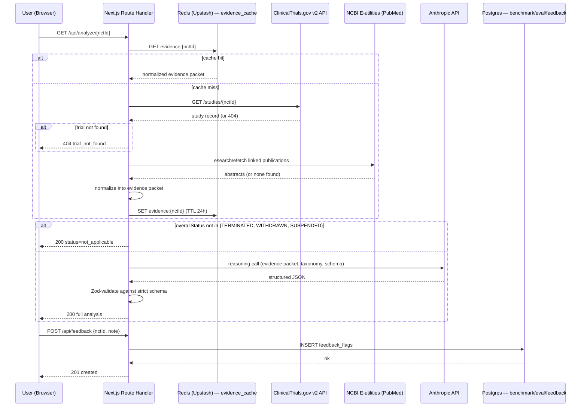

# Engineering Document — ClinicalAI-Trial Analysis

**Source PRD:** [PRD.md](../../PRD.md) (v2.0, Solution Review stage)
**Source Design System:** [design.md](../../design.md)
**Status:** Draft — pending approval before implementation begins

---

## 1. Executive Summary

**Project name:** ClinicalAI-Trial Analysis

**Business goal:** Give biotech analysts and competitive-intelligence researchers a way to understand *why* a clinical trial failed in under 20 seconds, from a single NCT ID, using only public data — replacing a 30–60 minute manual cross-reference task across ClinicalTrials.gov and PubMed.

**Problem statement:** 52,362 trials on ClinicalTrials.gov (8.8% of all registered studies) are TERMINATED, WITHDRAWN, or SUSPENDED. In a live sample of 200 TERMINATED trials, 11.5% report no substantive stop reason at all, and most of the remaining 88.5% give only a terse single-line cause with no deeper context. No existing tool (ClinicalTrials.gov/AACT, PubMed, Citeline/Trialtrove, GlobalData, or generic LLM chat) performs source-grounded, honestly-labeled causal reasoning over this data.

**Target users:**
- **Primary:** Biotech equity analyst / competitive-intelligence researcher doing pipeline diligence for an investment, licensing, or competitive read.
- **Secondary:** Academic/regulatory researcher doing landscape review; science journalist covering drug development.
- **Internal/maintainer:** The solo builder, who curates the evaluation benchmark set and reviews flagged low-quality analyses (not an end-user-facing role, but a real system actor — see Section 3).

**Success criteria** (from PRD Section 6):
- North Star: analyses completed **with zero unlabeled causal claims** (hard schema gate, not a soft target).
- 1,000 analyses completed in the first 90 days post-launch; P95 time-to-result < 20 seconds.
- Analysis error rate < 3%; top-ranked hypothesis matches the documented real cause in ≥ 70% of a 30–50 trial benchmark set.

---

## 2. Product Scope

### In Scope (MVP, v1)
- Single NCT ID input → validation → ClinicalTrials.gov v2 fetch → PubMed enrichment → LLM reasoning pass → four-block labeled result (Bottom Line, Ranked Hypotheses, Evidence, Guardrail).
- Fact / Inference / Hypothesis labeling on every rendered claim, schema-enforced.
- 7-category failure taxonomy classification (recruitment, efficacy, safety/toxicity, funding/business, operational/protocol, strategic/competitive, futility).
- Counter-argument required per hypothesis.
- Graceful handling of non-terminated trials (no fabricated failure narrative), nonexistent IDs, malformed IDs, and upstream API/LLM failures.
- Evidence-packet caching by NCT ID (not LLM output caching).
- Lightweight per-analysis feedback flag ("this doesn't look right") feeding a maintainer review queue.
- Persistent, non-collapsible disclaimer ("not medical or investment advice").
- Evaluation benchmark set + eval run logging (internal/maintainer-facing, not end-user-facing).

### Out of Scope (v1) — per PRD Section 5, Non-Goals
- User accounts, saved history, personalization, or any authentication.
- Batch or multi-trial analysis (one NCT ID per request only).
- Any data source beyond ClinicalTrials.gov and PubMed (no SEC filings, press releases, paid trial databases).
- File uploads of proprietary/non-public data.
- Billing, payments, or a paid tier.
- Native mobile app (responsive web only).
- Per-IP rate limiting (deferred — see Future Enhancements; default is off at launch per PRD Open Questions).

### Future Enhancements (post-MVP, per PRD Rollout Plan Weeks 9–12 and Open Questions)
- Shareable permalinks per NCT ID analysis.
- Lightweight per-IP rate limiting if LLM cost exposure becomes an issue.
- Directional paid batch-analysis tier (only if return-user data justifies it).
- Additional data sources (SEC filings, sponsor press releases) if the free-source hypothesis-quality bar proves achievable.

---

## 3. User Personas

| Persona | Type | Responsibilities / Goals | Permissions | Primary Workflow |
|---|---|---|---|---|
| Biotech Analyst / CI Researcher | Primary end user | Paste an NCT ID for a trial of interest; read the ranked hypotheses to inform an investment, licensing, or competitive assessment. | Public, unauthenticated — no account, no permissions model. | Analyze a Trial (Section 4.1) |
| Academic/Regulatory Researcher, Science Journalist | Secondary end user | Same workflow as primary persona, lower prioritization for UX polish. | Same as above. | Analyze a Trial (Section 4.1) |
| Solo Builder / Maintainer | Internal, non-UI actor | Curate the 30–50 trial benchmark set; review the weekly flagged-analysis queue; version and ship prompt/taxonomy revisions; monitor guardrail metrics. | Direct database/repo access — no admin UI in v1 (deliberately out of scope; maintainer operates via scripts and direct DB queries, see Section 11 `/scripts`). | Benchmark Curation & Prompt Review (Section 4.6) |

There is no admin, moderator, or elevated end-user role — the product has exactly one public-facing capability (analyze a trial), consistent with the PRD's stateless, no-accounts design.

---

## 4. User Flows

Format: `User Action → Frontend Behavior → Backend Processing → Database Interaction → System Response`

### 4.1 Analyze a Trial (core flow — happy path)
1. **User Action:** User lands on `/`, pastes an NCT ID (e.g., `NCT04368728`) into `{component.analyze-bar-pill}`. No submit button — the bar is friction-less (`lib/hooks/useNctIdAutoSubmit.ts`).
2. **Frontend Behavior:** Client-side regex classifies the value on every keystroke (`empty`/`typing`/`valid`/`invalid`). The moment it fully matches `NCT\d{8}`, `{component.valid-id-check}` appears and the bar auto-navigates to `/analysis/[nctId]` after a ~450ms pause, which mounts `AnalysisView` and immediately renders `AnalysisProgress` — staged status text (fetching → resolving publications → reasoning) over static skeleton blocks — while `AnalysisView`'s own `fetch('/api/analyze/[nctId]')` is in flight.
3. **Backend Processing:** `GET /api/analyze/[nctId]` triggers the pipeline: (a) check `evidence_cache` for a non-expired entry; on miss, (b) fetch ClinicalTrials.gov v2 record, (c) resolve linked PubMed publications via NCBI E-utilities, (d) normalize into an evidence packet, (e) write/refresh the cache entry, (f) run the Anthropic reasoning call against the evidence packet, (g) validate the LLM response against the strict Zod schema.
4. **Database Interaction:** Read/write `evidence_cache` (Upstash Redis, TTL 24h). No write to any relational table for a successful analysis — the LLM output itself is never persisted (explicit PRD decision: cache the fetch layer, not the reasoning).
5. **System Response:** `200 OK` with the full analysis JSON. Frontend renders `{component.bottom-line-card}`, `{component.hypothesis-card}` × N, `{component.evidence-row}` list, `{component.guardrail-band}`, and `{component.disclaimer-band}`.

### 4.2 Malformed NCT ID
1. **User Action:** User types an ID that doesn't match `NCT\d{8}` (e.g., `NCT123`).
2. **Frontend Behavior:** Inline validation error renders immediately under the input in `{colors.primary-error-text}` — no submit is possible, no network call is made.
3. **Backend Processing:** None triggered.
4. **Database Interaction:** None.
5. **System Response:** N/A (client-only).

### 4.3 Well-Formed but Nonexistent NCT ID
1. **User Action:** User submits a correctly formatted ID that isn't a real trial.
2. **Frontend Behavior:** Shows `{component.analysis-loading-state}`, then the error state.
3. **Backend Processing:** ClinicalTrials.gov v2 fetch returns 404; backend short-circuits — no PubMed call, no LLM call.
4. **Database Interaction:** None (cache is not written for a miss).
5. **System Response:** `404` with `{ error: "trial_not_found" }`. Frontend renders a plain-language "We couldn't find a trial with that ID" state with a link back to the input.

### 4.4 Non-Terminated Trial (COMPLETED / RECRUITING / ACTIVE_NOT_RECRUITING / etc.)
1. **User Action:** User submits a valid ID for a trial that is not TERMINATED, WITHDRAWN, or SUSPENDED.
2. **Frontend Behavior:** Loading state, then a distinct "no failure to analyze" result view (not the four-block layout).
3. **Backend Processing:** After fetching and normalizing, backend detects `overallStatus` is outside the three failure statuses and **skips the LLM call entirely** — no reasoning pass is run.
4. **Database Interaction:** Cache write for the evidence packet (still useful if the trial's status changes later or is re-queried).
5. **System Response:** `200 OK` with `{ status: "not_applicable", overallStatus, message }`. Frontend states plainly that the trial completed as planned or is still active.

### 4.5 Upstream Failure (ClinicalTrials.gov / NCBI / Anthropic API error)
1. **User Action:** Same as 4.1.
2. **Frontend Behavior:** Loading state, then a retry-able error card if the backend ultimately fails.
3. **Backend Processing:** On any upstream failure, retry once with exponential backoff (500ms base). If the retry also fails: for PubMed specifically, degrade gracefully and continue the pipeline with a "no publication data available" note; for ClinicalTrials.gov or Anthropic, fail the request entirely rather than render partial/unlabeled output.
4. **Database Interaction:** None on failure (no partial cache writes).
5. **System Response:** `502`/`503` with `{ error: "upstream_failure", retryable: true }`. Frontend shows "Something went wrong — try again" with a retry button; never renders a partially-parsed result.

### 4.6 Benchmark Curation & Prompt Review (internal, maintainer-only, no UI)
1. **User Action:** Maintainer runs `scripts/run-benchmark.ts` after a prompt/taxonomy revision.
2. **Frontend Behavior:** N/A — CLI/script only.
3. **Backend Processing:** Script iterates the `benchmark_trials` table, runs each through the current production pipeline, and writes results to `eval_runs`.
4. **Database Interaction:** Read `benchmark_trials`; write `eval_runs`.
5. **System Response:** CLI output summarizing plausibility scores and pass/fail against the ≥70% accuracy threshold (PRD Section 6). A revised prompt ships only if scores are equal or better than the current production version.

### 4.7 Submit Feedback Flag
1. **User Action:** On a results page, user clicks a lightweight "This doesn't look right" control.
2. **Frontend Behavior:** Opens a single-field optional note input, submits.
3. **Backend Processing:** `POST /api/feedback` validates payload, writes to `feedback_flags`.
4. **Database Interaction:** Insert into `feedback_flags` (nct_id, note, flagged_at, reviewed=false).
5. **System Response:** `201 Created`; frontend shows a brief "Thanks — this trial has been flagged for review" confirmation, no further interaction.

There is no signup, login, dashboard, payments, or admin-UI flow — all excluded per PRD Non-Goals.

---

## 5. Frontend Architecture

**Stack:** Next.js 14+ (App Router, fixed per skill requirement), TypeScript, Tailwind CSS (implements the design.md token system directly as Tailwind theme extensions), React Server Components for the initial page shell, client components for the input/interactive pieces.

**State management:** No global state library needed. `/analysis/[nctId]` is the one page with real client state (loading/error/done), owned by `AnalysisView` — a client component that fetches `GET /api/analyze/[nctId]` on mount, rather than the Server Component awaiting the pipeline directly. This was a deliberate revision from the original SSR-the-result approach: the reasoning pass can take 20-40s, and a server-blocking await has no way to surface *why* — `AnalysisView` shows real staged progress (fetching → resolving publications → reasoning) while the request is in flight, which a blocking SSR call can't do. Trade-off accepted: this page is no longer server-rendered with real content in the initial HTML (weaker for link-preview crawlers, irrelevant for a utility tool with no SEO surface), in exchange for actually communicating wait time to the person staring at the screen.

**Routing:**
- `/` — landing page with `{component.analyze-bar-pill}` and hero copy.
- `/analysis/[nctId]` — result page (client-fetched), covers happy path, not-found, invalid-format, and error states via the same route with different render branches inside `AnalysisView`.
- `/how-it-works` — static methodology page (referenced in `{component.top-nav}` and `{component.footer-light}`).

**UX states (per screen):**
- **Loading:** `{component.analysis-loading-state}` — narrowed input bar + four static skeleton blocks (`{colors.surface-soft}` fill, `{rounded.md}`), no shimmer animation (per design.md).
- **Empty (landing):** hero + `{component.analyze-bar-pill}` only.
- **Error:** malformed ID (inline, client-only), not-found (dedicated state), upstream failure (retry-able card, `{colors.primary-error-text}`).
- **Not applicable:** non-terminated trial state — distinct visual treatment from both success and error (ink/muted, not red).
- **Responsive:** breakpoints per design.md — mobile < 744px, tablet 744–1128px, desktop 1128–1440px, wide > 1440px; single-column layout at every breakpoint (no grid to collapse).
- **Accessibility:** WCAG 2.1 AA — 44×44px minimum touch targets on `theme-toggle`/`home-button`, a visible `focus-within` ring on both search bars (Rausch), keyboard-navigable input and result cards, `aria-live="polite"` region for the loading→result transition, semantic heading hierarchy (`h1` Bottom Line, `h2` per section).

**Page and component hierarchy:**
```
app/
├── layout.tsx                     (TopNav + FooterLight shell)
├── page.tsx                       (/ landing — AnalyzeBar)
├── how-it-works/page.tsx
└── analysis/[nctId]/
    ├── page.tsx                   (thin server component — parses nctId, renders AnalysisView)
    ├── error.tsx                  (safety-net boundary — see Section 5)
    └── components/
        ├── AnalysisView.tsx       (client — fetches /api/analyze/[nctId], owns loading/error/done state)
        ├── AnalysisProgress.tsx   (staged progress UI while the fetch is in flight)
        ├── BottomLineCard.tsx
        ├── HypothesisCard.tsx     (renders ConfidenceMeter + EpistemicTag[] + CounterArgumentBlock)
        ├── ConfidenceMeter.tsx
        ├── EpistemicTag.tsx       (Fact | Inference | Hypothesis variant)
        ├── EvidenceRow.tsx
        ├── GuardrailBand.tsx
        ├── DisclaimerBand.tsx
        ├── TrialStatusTag.tsx
        ├── TrialSnapshotCard.tsx  (non-failure statuses — fact-only, zero LLM calls)
        ├── NotFoundState.tsx
        ├── UpstreamErrorState.tsx
        └── FeedbackFlagControl.tsx
components/
├── AnalyzeBarPill.tsx              (friction-less — no submit button, see lib/hooks/useNctIdAutoSubmit.ts)
├── NavSearch.tsx                   (same friction-less hook, compact top-nav variant)
├── ValidIdCheck.tsx                (replaces AnalyzeOrb.tsx, deleted — trailing green-check indicator only)
├── TopNav.tsx
├── HomeButton.tsx                 (moved from analysis/ — now global, rendered in TopNav)
└── FooterLight.tsx
lib/
└── hooks/
    └── useNctIdAutoSubmit.ts       (shared classify-on-keystroke + auto-navigate logic for both search bars)
```

---

## 6. Backend Architecture

**Stack:** Next.js Route Handlers (serverless functions on Vercel — matches the PRD's stated Vercel hosting budget), TypeScript, Zod for request/response schema validation. `app/api/analyze/[nctId]/route.ts` exports `maxDuration = 60` — Vercel's default serverless timeout (10s) is shorter than the reasoning pass (20-40s), so without this every failure-status analysis was getting killed mid-request on production and surfacing as a generic upstream_failure.

**Core systems:**
- **No auth/authz** — every route is public; this is a deliberate scope decision (PRD Non-Goals), not an omission.
- **Input validation:** Zod schema for NCT ID format at the route boundary, re-validated server-side even though the client already checks (never trust client-only validation).
- **Business logic pipeline** (`lib/pipeline/analyzeTrial.ts`): orchestrates cache lookup → CT.gov fetch → PubMed enrichment → normalization → LLM reasoning → schema validation, in that order, with the short-circuit for non-terminated trials happening after normalization but before any LLM call.
- **External API clients** (`lib/clients/`): `ctgov.ts`, `pubmed.ts`, `anthropic.ts` — each owns its own retry/backoff and error typing so the pipeline layer stays free of transport concerns.
- **Caching layer** (`lib/cache.ts`): Upstash Redis client, `evidence:{nctId}` key, 24h TTL, stores the normalized evidence packet only (never the LLM output).
- **Error handling middleware:** a single `withErrorBoundary` wrapper on every route handler normalizes thrown errors into the `{ error, retryable }` response shape used by Section 4.5.
- **Rate limiting:** stubbed but disabled at launch (`lib/rateLimit.ts` exists with an Upstash-based sliding-window implementation, gated behind an env flag `RATE_LIMIT_ENABLED=false` by default) — ships inactive per PRD Open Questions, can be flipped on without a redeploy of application logic.

**Service interaction diagram:**


---

## 7. Database Design and Schema

The product is stateless with respect to **users** (no accounts, per Non-Goals), but requires minimal operational storage for caching, benchmarking, and the feedback-review loop. Two stores:

- **Upstash Redis** — ephemeral evidence-packet cache (TTL-based, not relational).
- **Postgres (Neon, via Vercel)** — small relational tables for benchmark/eval/feedback data, which must persist and be queryable by the maintainer.

### `benchmark_trials`
| Column | Type | Constraints | Purpose |
|---|---|---|---|
| `nct_id` | `varchar(11)` | PK | The trial in the ground-truth evaluation set |
| `documented_true_reason` | `text` | NOT NULL | The corroborated real failure cause, from `whyStopped` + published post-mortem/news coverage |
| `true_reason_category` | `varchar(32)` | NOT NULL | One of the 7 taxonomy categories, for stratified accuracy scoring |
| `source_url` | `text` | NOT NULL | Citation for the documented true reason |
| `sponsor_class` | `varchar(32)` | NULL | INDUSTRY / NIH / ACADEMIC / OTHER — enables the Fairness monitoring stratification from PRD Section 4 |
| `added_at` | `timestamptz` | NOT NULL, default `now()` | |
| `notes` | `text` | NULL | |

### `eval_runs`
| Column | Type | Constraints | Purpose |
|---|---|---|---|
| `id` | `uuid` | PK, default `gen_random_uuid()` | |
| `nct_id` | `varchar(11)` | FK → `benchmark_trials.nct_id`, NOT NULL | |
| `run_at` | `timestamptz` | NOT NULL, default `now()` | |
| `prompt_version` | `varchar(16)` | NOT NULL | e.g. `v1.3` — matches the versioned prompt file in `/prompts` |
| `top_hypothesis_category` | `varchar(32)` | NOT NULL | What the model actually ranked #1 |
| `matched_true_reason` | `boolean` | NOT NULL | Computed: does `top_hypothesis_category` match `benchmark_trials.true_reason_category` |
| `reviewer_plausibility_score` | `smallint` | NULL, CHECK 1–5 | Manual QA score, added after human review |
| `notes` | `text` | NULL | |

**Relationship:** `eval_runs.nct_id` → `benchmark_trials.nct_id` (many eval runs per benchmark trial, one per prompt version tested). This table is the durable version of the PRD's "eval spreadsheet."

### `feedback_flags`
| Column | Type | Constraints | Purpose |
|---|---|---|---|
| `id` | `uuid` | PK, default `gen_random_uuid()` | |
| `nct_id` | `varchar(11)` | NOT NULL | Not a FK — any analyzed trial can be flagged, not just benchmark trials |
| `note` | `text` | NULL | Optional free-text from the flagging user |
| `flagged_at` | `timestamptz` | NOT NULL, default `now()` | |
| `reviewed` | `boolean` | NOT NULL, default `false` | |
| `reviewed_at` | `timestamptz` | NULL | |

**Indexes:** `eval_runs(nct_id, run_at)` for trend queries; `feedback_flags(reviewed, flagged_at)` for the maintainer's weekly review queue (PRD: "checked weekly against the benchmark set").

**No `users`, `sessions`, or `accounts` tables exist** — this is an explicit scope boundary, not an oversight.

### Redis key schema
| Key pattern | Value | TTL | Purpose |
|---|---|---|---|
| `evidence:{nctId}` | JSON-serialized normalized evidence packet | 24h | Avoids redundant ClinicalTrials.gov/PubMed calls on repeat lookups of the same trial |
| `ratelimit:{ip}` | sliding-window counter | 60s window | Present but inactive (`RATE_LIMIT_ENABLED=false` at launch) |

---

## 8. AI Architecture

**LLM provider:** Anthropic API, direct (resolved decision, PRD Section 3 — rejected AWS Bedrock for MVP due to setup overhead with no benefit for a solo build).

**Model:** Claude Sonnet (`claude-sonnet-5`) — chosen for reliable structured/JSON output, sufficient context window to hold a full trial record plus multiple PubMed abstracts in a single call, per-analysis cost low enough to sustain a free public tool, and latency low enough to hit the <20s P95 target. (Claude Opus is available as a fallback upgrade path if benchmark accuracy under-shoots the ≥70% bar and cost tolerates it; Haiku is not used — insufficient reasoning depth for cross-signal evidence synthesis.)

**Prompt strategy** (per PRD Section 4):
- **Structured extraction** against a fixed, explicit 7-category failure taxonomy (recruitment, efficacy, safety/toxicity, funding/business, operational/protocol, strategic/competitive, futility) — categories are non-exclusive, multiple may apply.
- **Few-shot examples** of correctly labeled Fact/Inference/Hypothesis output embedded in the system prompt (the 10 representative examples in PRD Section 4 form the seed set; expand to the full 15–25 example set during prompt development, stored in `/prompts/examples/`).
- **Hidden chain-of-thought scratchpad**: the model reasons through the evidence in a `<scratchpad>` block that is stripped before the response is returned to the client — never shown to the user, used only to improve final-answer quality.
- **Strict output schema**, enforced via Anthropic's structured output / tool-use JSON mode:

```typescript
// lib/schema/analysisResult.ts
const EpistemicStatus = z.enum(["fact", "inference", "hypothesis"]);

const EvidenceItem = z.object({
  claim: z.string(),
  epistemicStatus: EpistemicStatus,
  sourceUrl: z.string().url(),
});

const Hypothesis = z.object({
  category: z.enum([
    "recruitment", "efficacy", "safety_toxicity", "funding_business",
    "operational_protocol", "strategic_competitive", "futility",
  ]),
  label: z.string(),               // short human-readable name, e.g. "Recruitment Shortfall"
  confidence: z.enum(["low", "medium", "high", "very_high"]),
  evidenceFor: z.array(EvidenceItem).min(1),
  strongestCounterArgument: z.string().min(1),  // required — never optional
});

const AnalysisResult = z.object({
  bottomLine: z.string(),
  hypotheses: z.array(Hypothesis).min(1),
  evidence: z.array(EvidenceItem),
  guardrail: z.string(),
});
```
Every field in `EvidenceItem` and every claim inside `bottomLine`/`guardrail` must carry (or be accompanied by) an epistemic label — this is validated post-hoc by a lint pass that rejects any response where labeled coverage isn't complete, per the North Star metric's hard 0%-unlabeled gate.

**Context/memory:** Fully stateless, single-shot per analysis. No conversation memory, no multi-turn context — each `/api/analyze/[nctId]` call is one independent reasoning pass over that trial's evidence packet only.

**Token limits:** The evidence packet (trial record fields + up to N linked abstracts, N capped to keep the call well within context) is size-capped in `lib/pipeline/buildEvidencePacket.ts`; abstracts are truncated (not the structured trial fields, which are never truncated, per the PRD's stated cost/accuracy tradeoff) if the combined packet would exceed the budget.

**Rate limiting / cost controls:**
- NCBI E-utilities: registered API key from day one (10 req/s vs. 3 req/s unauthenticated), with backoff in `lib/clients/pubmed.ts`.
- Anthropic: one call per analysis; evidence-packet caching (not LLM-output caching) is the primary cost control, since repeat lookups of the same NCT ID skip the fetch/enrichment cost but still get a fresh reasoning pass (explicit PRD decision — reasoning is never served stale).
- Per-IP request rate limiting exists in code but ships disabled (see Section 6).

**Fallback:** On LLM call failure or schema-validation failure, retry once; if the retry also fails or fails validation, return the upstream-failure error state (Section 4.5) — the system never renders a response that fails schema validation, even partially.

---

## 9. API Specification

### `GET /api/analyze/[nctId]`
- **Auth required:** None (public).
- **Path params:** `nctId: string` — must match `^NCT\d{8}$`.
- **Request schema:** none (GET, no body).
- **Response schema (200, terminated/withdrawn/suspended trial):**
  ```json
  {
    "status": "analyzed",
    "trial": { "nctId": "string", "title": "string", "overallStatus": "TERMINATED" },
    "bottomLine": "string",
    "hypotheses": [ /* Hypothesis[] — see Section 8 schema */ ],
    "evidence": [ /* EvidenceItem[] */ ],
    "guardrail": "string"
  }
  ```
- **Response schema (200, non-terminated trial):**
  ```json
  { "status": "not_applicable", "trial": { "nctId": "string", "overallStatus": "COMPLETED" }, "message": "string" }
  ```
- **Error responses:**
  - `400 { "error": "invalid_format" }` — malformed NCT ID (defense-in-depth; client already blocks this).
  - `404 { "error": "trial_not_found" }` — well-formed ID, no matching study.
  - `502 { "error": "upstream_failure", "retryable": true }` — ClinicalTrials.gov or Anthropic failure after one retry.
  - `500 { "error": "internal_error" }` — schema validation failure on the LLM response after retry, or unhandled exception.
- **Validation rules:** NCT ID format checked before any external call; LLM response Zod-validated before being returned — a validation failure is treated as a `500`, never partially forwarded.

### `POST /api/feedback`
- **Auth required:** None.
- **Request schema:**
  ```json
  { "nctId": "string (NCT\\d{8})", "note": "string, optional, max 1000 chars" }
  ```
- **Response schema (201):** `{ "id": "uuid", "flagged_at": "ISO8601" }`
- **Error responses:** `400 { "error": "invalid_payload" }` on schema failure.
- **Validation rules:** `nctId` format-checked; `note` length-capped server-side regardless of client enforcement.

### `GET /api/health`
- **Auth required:** None.
- **Purpose:** Liveness/readiness check for uptime monitoring — verifies Redis and Postgres connectivity.
- **Response schema (200):** `{ "status": "ok", "redis": "ok", "postgres": "ok" }` or `503` with per-dependency status on failure.

No other routes exist — no auth endpoints, no user CRUD, no payment endpoints, consistent with Non-Goals.

---

## 10. Feature Breakdown

### Phase 1 — MVP (Weeks 1–8, maps to PRD Rollout Plan)
| Feature | Acceptance Criteria | Dependencies |
|---|---|---|
| ClinicalTrials.gov v2 data fetch + normalization | Correctly normalizes 20+ real terminated-trial IDs across data-completeness levels | None |
| PubMed enrichment | Correctly resolves publications for known-published trials; correctly flags unpublished ones | Data fetch layer |
| Evidence-packet caching (Redis) | Cache hit skips CT.gov/PubMed calls; 24h TTL verified | Data fetch + enrichment |
| Reasoning engine (taxonomy + labeling contract) | 100% of benchmark-set analyses pass schema validation with zero unlabeled claims; ≥70% top-hypothesis accuracy against benchmark set | Data + enrichment layers, benchmark set (Section 7) |
| Four-block results UI | Full flow works for valid/invalid/not-found/not-applicable/error states | Reasoning engine, design.md components |
| Feedback flag control | Flag persists to `feedback_flags`, visible in maintainer review query | Postgres schema |
| Disclaimer + Guardrail bands | Present and non-dismissible on every result render | Frontend components |

### Phase 2 — Post-Launch Iteration (Weeks 9–12, per PRD Rollout Plan)
| Feature | Acceptance Criteria | Dependencies |
|---|---|---|
| Shareable permalinks | `/analysis/[nctId]` is already linkable (the client fetch re-runs correctly for any visitor) — this phase adds OpenGraph/share metadata (which needs a server-rendered path for that specific request, e.g. a route handler generating preview images/tags) and a "copy link" control | Phase 1 results UI |
| Per-IP rate limiting (activation) | Flip `RATE_LIMIT_ENABLED=true`; verify sliding-window behavior under load | Existing `lib/rateLimit.ts` stub |
| Prompt/taxonomy revision cycle | Weekly benchmark re-run process operating per Section 4.6 | Benchmark + eval tables |

### Phase 3 — Conditional / Future (only if usage data justifies)
| Feature | Acceptance Criteria | Dependencies |
|---|---|---|
| Batch/pipeline-report paid tier | Requires billing integration, accounts — explicitly deferred, no acceptance criteria defined until validated | Return-user signal from Phase 1/2 |
| Additional data sources (SEC filings, press releases) | Only pursued if free-source hypothesis-quality bar (≥70%) proves insufficient | Phase 1 benchmark results |

---

## 11. Folder Structure

```
/
├── app/
│   ├── layout.tsx
│   ├── page.tsx                          # landing
│   ├── how-it-works/page.tsx
│   ├── analysis/[nctId]/
│   │   ├── page.tsx
│   │   ├── loading.tsx
│   │   └── components/                   # page-scoped result components
│   └── api/
│       ├── analyze/[nctId]/route.ts
│       ├── feedback/route.ts
│       └── health/route.ts
├── components/                           # shared/global components (nav, footer, input)
├── lib/
│   ├── clients/
│   │   ├── ctgov.ts                      # ClinicalTrials.gov v2 client
│   │   ├── pubmed.ts                     # NCBI E-utilities client
│   │   └── anthropic.ts                  # Anthropic API client
│   ├── pipeline/
│   │   ├── analyzeTrial.ts               # orchestrator
│   │   └── buildEvidencePacket.ts        # normalization + token-budget capping
│   ├── schema/
│   │   └── analysisResult.ts             # Zod schemas (Section 8)
│   ├── taxonomy.ts                       # 7-category failure taxonomy definitions
│   ├── cache.ts                          # Redis client wrapper
│   ├── db.ts                             # Postgres client (Drizzle)
│   ├── rateLimit.ts                      # sliding-window limiter (inactive at launch)
│   └── errors.ts                         # withErrorBoundary + typed error classes
├── db/
│   └── schema.ts                         # Drizzle schema: benchmark_trials, eval_runs, feedback_flags
├── prompts/
│   ├── reasoning-prompt.v1.md            # versioned system prompt
│   └── examples/                         # 15–25 few-shot examples (Section 8)
├── scripts/
│   └── run-benchmark.ts                  # maintainer eval script (Section 4.6)
├── tests/
│   ├── unit/
│   ├── integration/
│   └── e2e/
├── docs/
│   └── engineering/engineering-doc.md    # this document
├── design.md
├── PRD.md
└── package.json
```

---

## 12. Naming Conventions

| Category | Convention | Example |
|---|---|---|
| Files (components) | PascalCase | `HypothesisCard.tsx` |
| Files (utilities/lib) | camelCase | `buildEvidencePacket.ts` |
| Folders | kebab-case | `how-it-works/` |
| React components | PascalCase | `AnalyzeBarPill` |
| Hooks | camelCase, `use` prefix | `useAnalysisStatus` |
| API route files | Next.js convention | `app/api/analyze/[nctId]/route.ts` |
| DB tables | snake_case, plural | `benchmark_trials`, `eval_runs`, `feedback_flags` |
| DB columns | snake_case | `reviewer_plausibility_score` |
| Env vars | SCREAMING_SNAKE_CASE | `ANTHROPIC_API_KEY`, `RATE_LIMIT_ENABLED` |
| Prompt files | versioned, semantic | `reasoning-prompt.v1.md`, `reasoning-prompt.v2.md` |
| Zod schemas | PascalCase, `Schema`-free (type-as-value) | `AnalysisResult`, `Hypothesis` |
| Config files | tool-standard | `tailwind.config.ts`, `drizzle.config.ts` |

---

## 13. Testing Strategy

| Layer | Framework | Scope | Coverage Target |
|---|---|---|---|
| Unit | Vitest | `buildEvidencePacket`, taxonomy classification helpers, Zod schema edge cases, NCT ID validators | ≥ 80% on `lib/` |
| Integration | Vitest + mocked HTTP (msw) | API routes (`/api/analyze/[nctId]`, `/api/feedback`) against mocked ClinicalTrials.gov/PubMed/Anthropic responses, covering all 5 flows in Section 4 | All Section 4 flows exercised at least once |
| E2E | Playwright | Full browser flow: paste ID → see result; malformed ID; not-found ID; non-terminated trial; feedback flag submission | Core happy path + every error state in Section 4 |
| AI Quality (non-CI) | Custom script (`scripts/run-benchmark.ts`) | Runs the 30–50 trial benchmark set against production; not part of the standard CI gate — run manually/weekly per PRD Section 6 | ≥ 70% top-hypothesis accuracy; 100% schema-label coverage |

CI (GitHub Actions or Vercel's build checks) runs unit + integration + E2E on every PR. The AI Quality benchmark is intentionally kept out of CI (it costs real LLM tokens per run and is a slower, judgment-involving process) and instead runs on a maintainer-triggered or weekly schedule, per the PRD's post-launch monitoring plan.

---

## 14. Specs to Implementation Mapping

| PRD / Design Spec | Implementation Files | Flow |
|---|---|---|
| PRD 4: NCT ID input + client format validation | `components/AnalyzeBarPill.tsx`, regex in `lib/schema/nctId.ts` | User types → client regex → route to `/analysis/[nctId]` or inline error |
| PRD 4: ClinicalTrials.gov v2 fetch + normalization | `lib/clients/ctgov.ts`, `lib/pipeline/buildEvidencePacket.ts` | `app/api/analyze/[nctId]/route.ts` → `analyzeTrial.ts` → `ctgov.ts` |
| PRD 4: PubMed enrichment | `lib/clients/pubmed.ts` | Called from `analyzeTrial.ts` after CT.gov fetch succeeds |
| PRD 4: 7-category taxonomy + fact/inference/hypothesis contract | `lib/taxonomy.ts`, `lib/schema/analysisResult.ts`, `prompts/reasoning-prompt.v1.md` | `analyzeTrial.ts` → `clients/anthropic.ts` → Zod validation |
| PRD 4: counter-argument requirement | `Hypothesis.strongestCounterArgument` (required field) in `lib/schema/analysisResult.ts`; rendered by `app/analysis/[nctId]/components/HypothesisCard.tsx` (counter-argument sub-block) | Schema-enforced at the API boundary, rendered in `{component.hypothesis-card}`'s counter-argument sub-block per design.md |
| PRD 4: non-terminated trial handling (US-4 equivalent) | `analyzeTrial.ts` status branch; `lib/pipeline/buildTrialSnapshot.ts`; `app/analysis/[nctId]/components/TrialSnapshotCard.tsx` | Flow 4.4 |
| PRD 4: retry-then-error, graceful PubMed degradation | `lib/errors.ts` (`withErrorBoundary`), retry logic in `clients/ctgov.ts` / `clients/anthropic.ts` | Flow 4.5 |
| PRD 4: prompt improvement plan / feedback flag | `app/api/feedback/route.ts`, `db/schema.ts` (`feedback_flags`), `FeedbackFlagControl.tsx` | Flow 4.7 |
| PRD 6: AI Quality Bar (benchmark set, eval tracking) | `db/schema.ts` (`benchmark_trials`, `eval_runs`), `scripts/run-benchmark.ts` | Flow 4.6 |
| PRD 6: guardrail metric — 0% unlabeled claims | Post-hoc label-coverage lint in `lib/schema/analysisResult.ts` validation step | Rejects any LLM response failing full label coverage, forces retry/error path |
| design.md: `analyze-bar-pill`, `nav-search`, `valid-id-check` | `components/AnalyzeBarPill.tsx`, `components/NavSearch.tsx`, `components/ValidIdCheck.tsx`, `lib/hooks/useNctIdAutoSubmit.ts` | Landing page + top nav |
| design.md: `bottom-line-card` | `app/analysis/[nctId]/components/BottomLineCard.tsx` | Result render |
| design.md: `hypothesis-card`, `confidence-meter`, `tag-fact`/`tag-inference`/`tag-hypothesis` | `HypothesisCard.tsx`, `ConfidenceMeter.tsx`, `EpistemicTag.tsx` | Result render |
| design.md: `evidence-row` | `EvidenceRow.tsx` | Result render |
| design.md: `guardrail-band`, `disclaimer-band` | `GuardrailBand.tsx`, `DisclaimerBand.tsx` | Result render, persistent on every result page |
| design.md: `trial-status-tag` | `TrialStatusTag.tsx` | Result header |
| design.md: `analysis-loading-state` | `app/analysis/[nctId]/components/AnalysisProgress.tsx` | Flow 4.1 step 2 |
| PRD 5 (Non-Goals): no accounts/auth | Absence of any `auth/` directory, `users` table, or session middleware | N/A — enforced by omission |
